# 💻 Portfólio - Renan De Paula

<p align="center">
  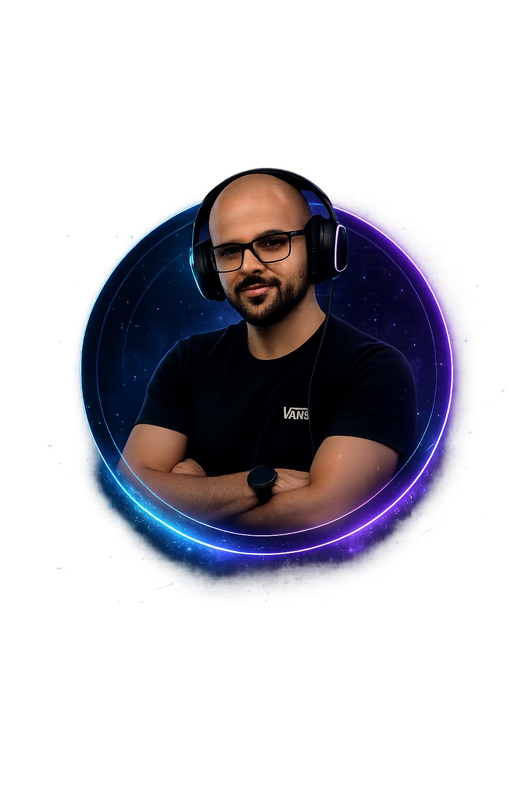
</p>

<p align="center">
  <strong>Portfólio profissional desenvolvido com foco em design moderno, responsividade e experiência do usuário.</strong>
</p>

<p align="center">
  <a href="https://renan-de-paula.github.io/portifolio/" target="_blank">
    🌐 Ver online no GitHub Pages
  </a>
</p>

---

# 📌 Sobre o Projeto

Este projeto foi desenvolvido com o objetivo de apresentar minhas habilidades como desenvolvedor, meus conhecimentos técnicos, experiências, tecnologias utilizadas e alguns projetos desenvolvidos durante meus estudos.

O portfólio foi criado utilizando apenas tecnologias front-end, com foco em:

- Interface moderna e profissional
- Responsividade para diferentes dispositivos
- Animações suaves
- Estrutura organizada
- Boa experiência visual
- Código limpo e escalável

---

# 🚀 Tecnologias Utilizadas

<div align="center">

| Tecnologia | Uso no Projeto |
|---|---|
| HTML5 | Estrutura da aplicação |
| CSS3 | Estilização e animações |
| JavaScript | Interatividade |
| Font Awesome | Ícones |
| Google Fonts | Tipografia |
| Devicon | Ícones de tecnologias |

</div>

---

# 🎨 Funcionalidades

✅ Tema Dark/Light  
✅ Menu responsivo  
✅ Animações modernas  
✅ Efeito de digitação  
✅ Scroll Reveal  
✅ Cards tecnológicos  
✅ Carrossel de projetos  
✅ Contato rápido  
✅ Links sociais  
✅ Layout responsivo  

---

# 🖼️ Preview do Projeto

## 📷 Tela Inicial

*Dark*
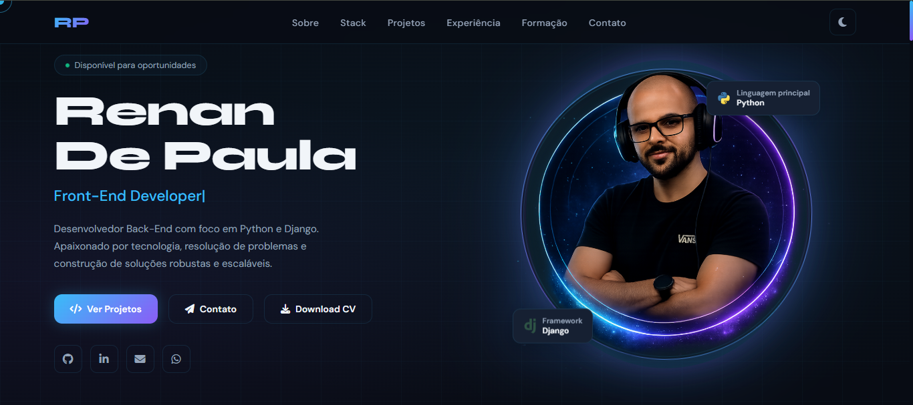
*Light*
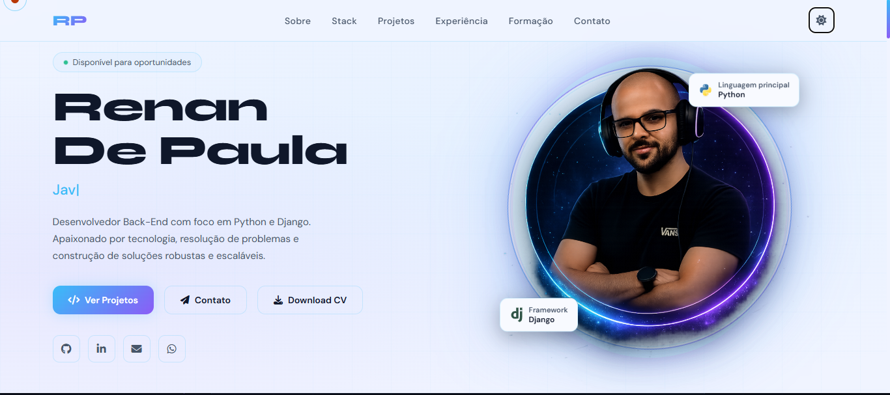

---

## 📷 Sessão Sobre

*Dark*
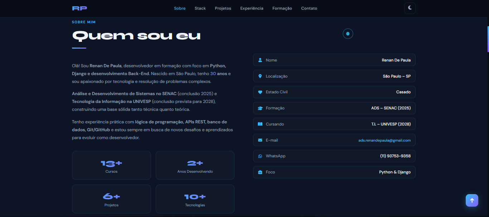
*Light*
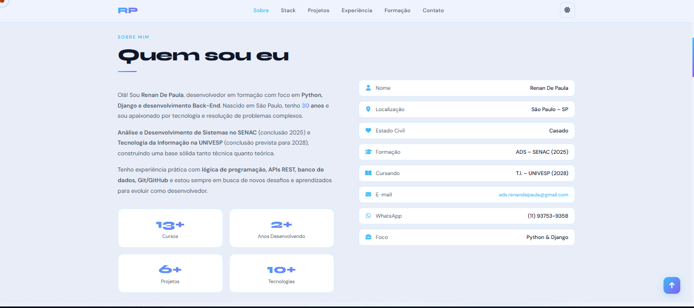

---

## 📷 Stack Tecnológica

*Dark*
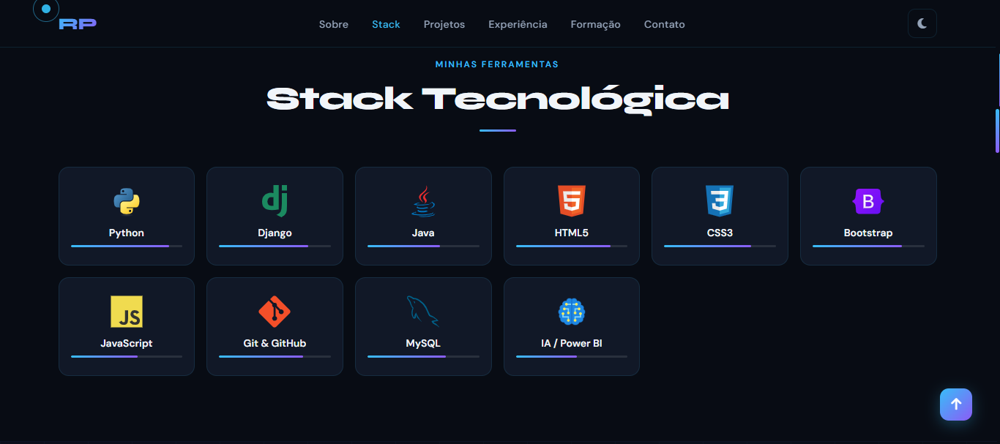
*Light*
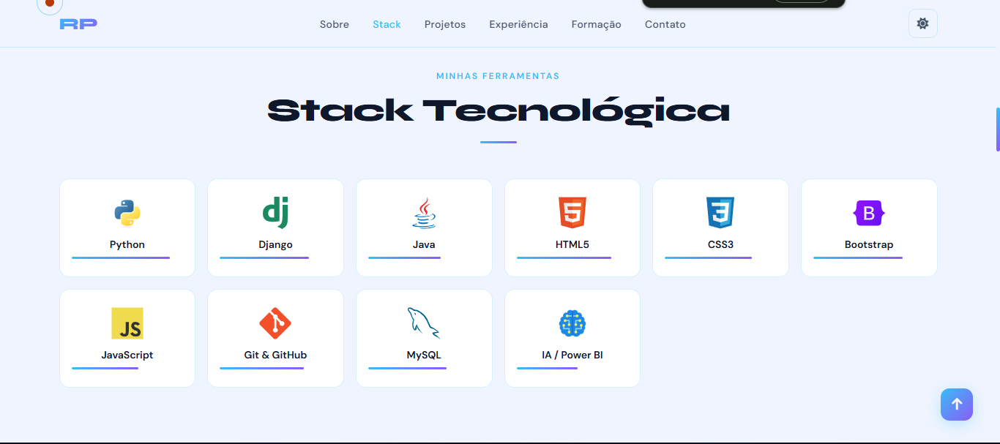

---

## 📷 Projetos

*Dark*
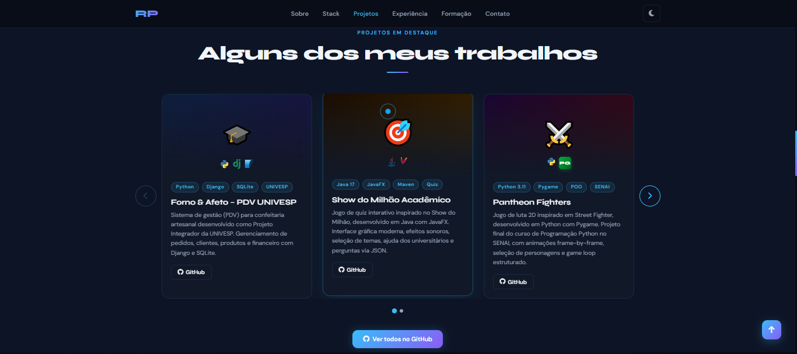
*Light*
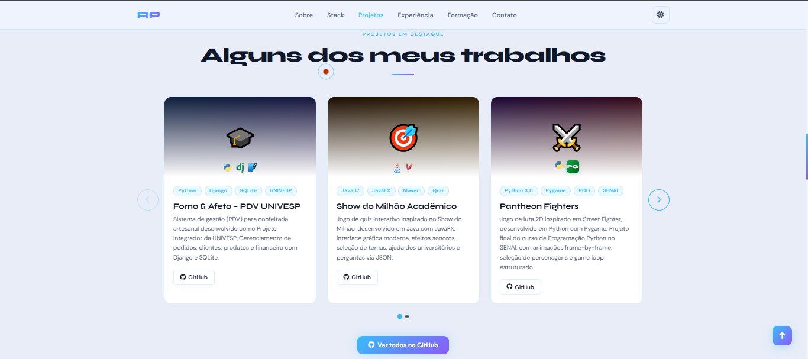

---

## 📷 Contato

*Dark*
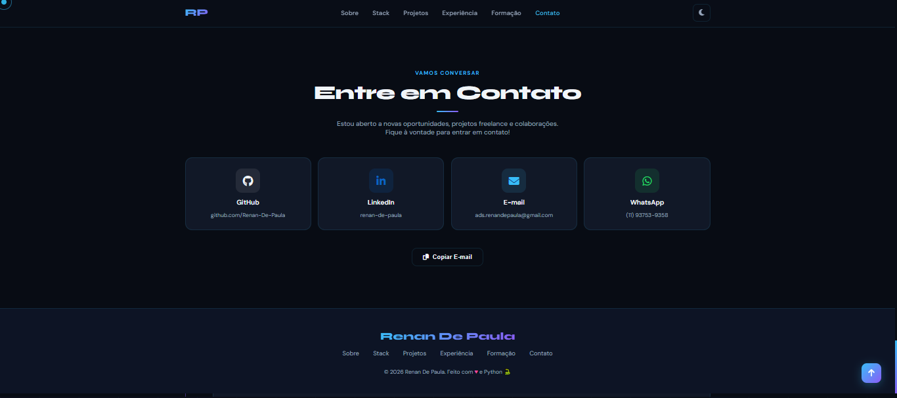
*Light*
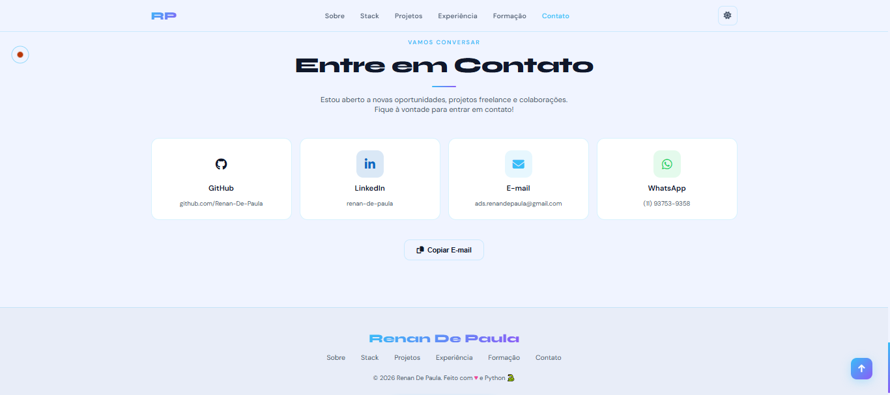

---

# 📂 Estrutura do Projeto

```bash
portifolio/
│
├── index.html
│
├── src/
│   ├── css/
│   │   └── style.css
│   │
│   └── img/
│       ├── perfil.png
│       ├── screenshots/
│       │   ├── home.png
│       │   ├── homelight.png
│       │   ├── sobre.png
│       │   ├── sobrelight.png
│       │   ├── stack.png
│       │   ├── stacklight.png
│       │   ├── projetos.png
│       │   ├── projetoslight.png
│       │   ├── contato.png
│       │   └── contatolight.png
│       └── projetos/
│           ├── fornoAfetoPedidos.png
│           ├── showmilhao.png
│           ├── pantheonfighters.png
│           ├── dashboardVisaoGeral.png
│           └── vacinApp.png
│
└── README.md
```

---

# ⚙️ Como Executar o Projeto

## 1️⃣ Clone o repositório

```bash
git clone https://github.com/Renan-De-Paula/portifolio.git
```

---

## 2️⃣ Acesse a pasta

```bash
cd portifolio
```

---

## 3️⃣ Execute o projeto

Basta abrir o arquivo `index.html` no navegador.

Ou acesse diretamente pelo GitHub Pages:  
🔗 https://renan-de-paula.github.io/portifolio/

---

# 📱 Responsividade

O projeto foi desenvolvido pensando em diferentes tamanhos de tela:

- Desktop
- Notebook
- Tablet
- Smartphone

---

# 🧠 Aprendizados

Durante o desenvolvimento deste projeto, pratiquei principalmente:

- Estruturação semântica com HTML
- Organização avançada de CSS
- Responsividade
- Animações modernas
- Manipulação de DOM
- Design UI/UX
- Organização visual de portfólio profissional

---

# 📌 Melhorias Futuras

- [ ] Adicionar backend para formulário
- [ ] Adicionar download real do currículo
- [ ] Criar versão em React
- [ ] Adicionar mais projetos
- [ ] Integração com APIs
- [ ] Melhorar acessibilidade

---

# 📬 Contato

## 👨‍💻 Renan De Paula

📍 São Paulo - SP  
📧 ads.renandepaula@gmail.com  

### 🔗 Redes Sociais

- GitHub: https://github.com/Renan-De-Paula
- LinkedIn: https://www.linkedin.com/in/renan-de-paula-7ba232158/

---

# ⭐ Considerações Finais

Este projeto representa minha evolução como desenvolvedor e meu foco em construir aplicações cada vez mais modernas, organizadas e profissionais.

Caso tenha gostado do projeto, fique à vontade para deixar uma ⭐ no repositório.

---

<p align="center">
  Desenvolvido por Renan De Paula 🚀
</p>
